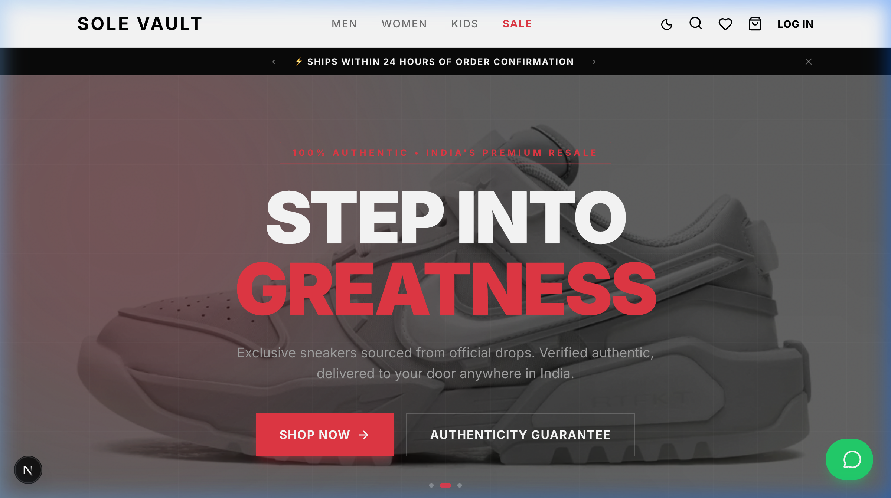
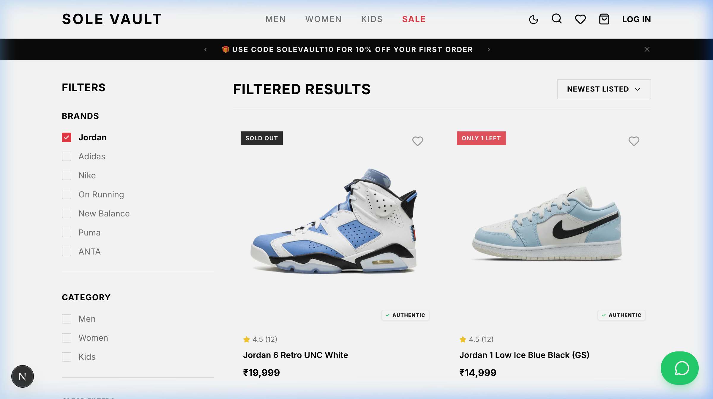
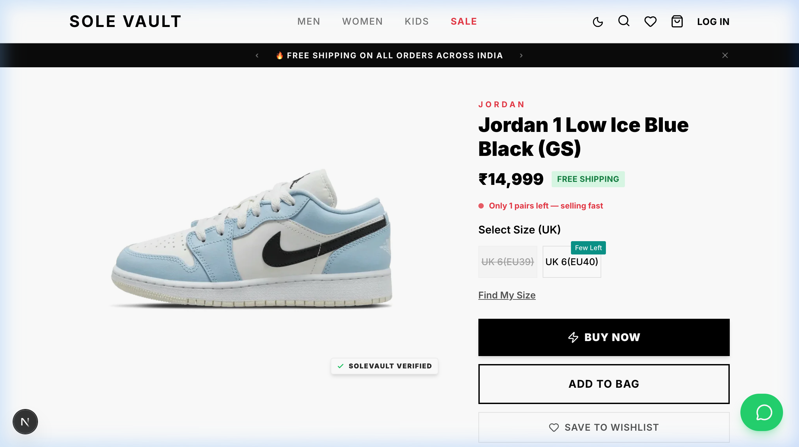
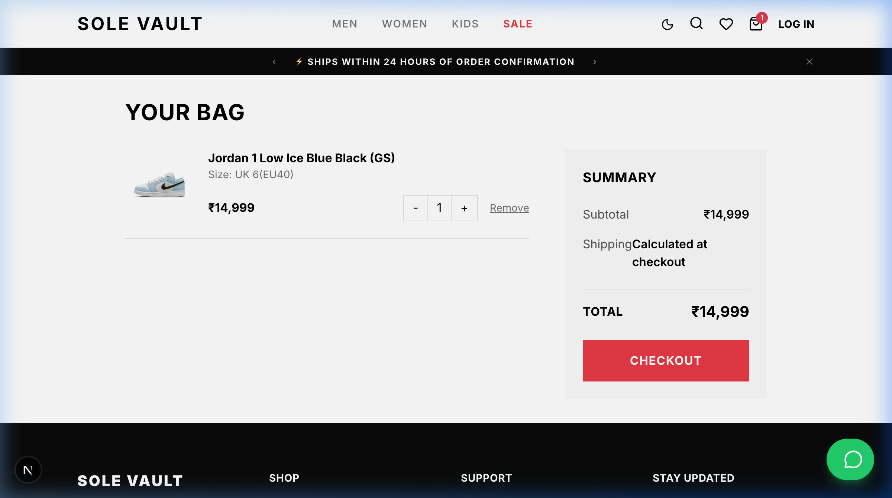
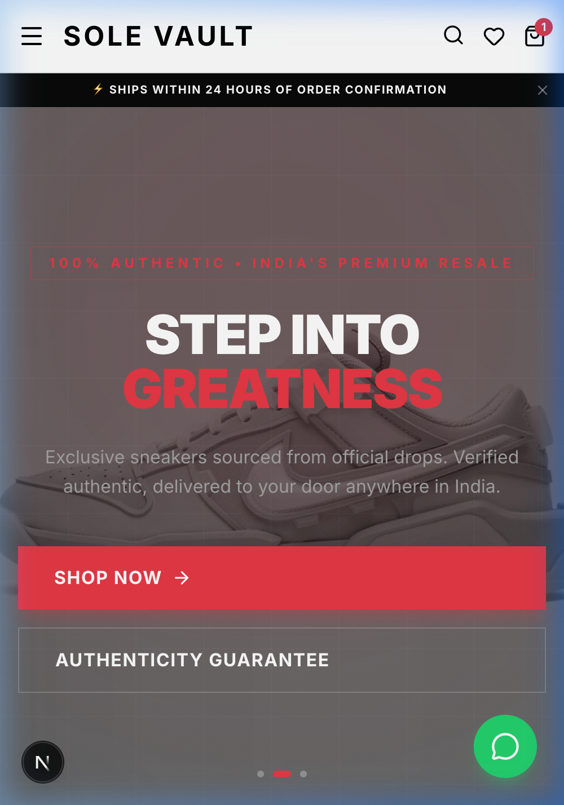

# Fiverr Portfolio Assets: SoleVault

This document contains high-quality screenshots and descriptions for your Fiverr portfolio. You can find all the images in the `./portfolio_assets/` folder in this project.

## 🖼 Screenshots

### 1. Hero Experience (Desktop)
A stunning first impression featuring glassmorphism, dynamic typography, and a premium sneaker backdrop.

### 2. Advanced Search & Filtering
Demonstrates the complex filtering system (Brand, Category, Size) and the clean product grid layout.

### 3. Product Detail Page
Shows the interactive image gallery, price display, and the custom size selection interface.

### 4. Shopping Bag & Checkout Flow
Highlights the "Add to Cart" functionality, local storage synchronization, and the professional order summary.

### 5. Mobile Responsiveness
Showcases how the premium design translates perfectly to mobile devices, ensuring a great user experience on all screens.

---

## 📝 Portfolio Description Suggestions

### Title Ideas:
- **Premium Sneaker Resale Marketplace with Next.js & Supabase**
- **Full-Stack E-commerce Store with Advanced Filtering & Payments**
- **High-Performance Resell Platform: SoleVault Case Study**

### Project Description:
"I developed **SoleVault**, a high-end sneaker resale marketplace focused on a premium user experience and robust technical foundations.

**Key Technical Achievements:**
- **Dynamic Discovery**: Implemented a URL-driven filtering system for brands, sizes, and price ranges.
- **Secure Payments**: Integrated PayU with server-side SHA-512 hashing for secure transactions.
- **Logistics Integration**: Integrated GoKwik for address verification and RTO (Return to Origin) risk assessment.
- **Real-time Performance**: Used Prisma with PostgreSQL and Supabase for a lightning-fast, scalable backend.
- **Aesthetic UX**: Created a custom design system with glassmorphism, smooth transitions, and a mobile-first approach."

---
*Generated by Antigravity*
